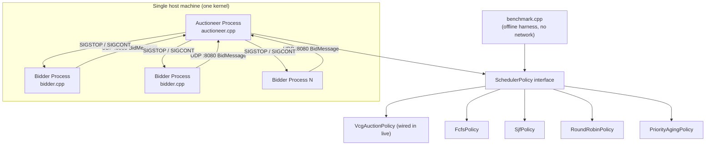
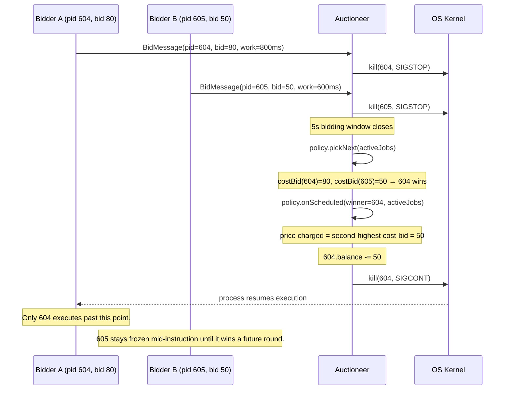
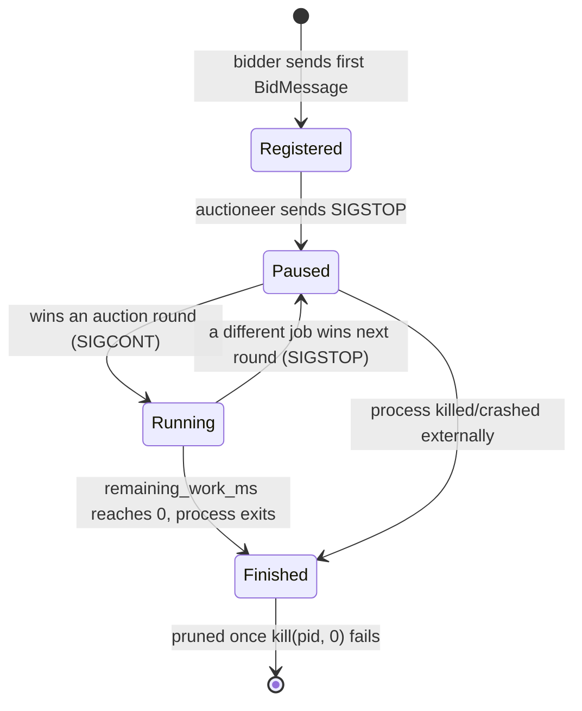

# Architecture & Design Rationale

This document explains **what** the system does, **why** it's built the
way it is, and **how** the pieces fit together. The README covers how to
build and run it; this covers the reasoning, so you can defend every
design choice under questioning.

## Table of contents

1. [Overview](#1-overview)
2. [Why an auction-based scheduler?](#2-why-an-auction-based-scheduler)
3. [System architecture](#3-system-architecture)
4. [Component reference](#4-component-reference)
5. [Life of a round](#5-life-of-a-round-sequence-walkthrough)
6. [Job lifecycle](#6-job-lifecycle)
7. [Design decisions and trade-offs](#7-design-decisions-and-trade-offs)
8. [Complexity notes](#8-complexity-notes)
9. [Known limitations](#9-known-limitations)
10. [Extending the project](#10-extending-the-project)

---

## 1. Overview

The project has two independent ways to run the same scheduling logic:

- **Live mode** (`auctioneer.cpp` + `bidder.cpp`): separate OS processes
  bid for CPU time over UDP. A central auctioneer resolves each round
  and uses real POSIX signals (`SIGSTOP`/`SIGCONT`) to actually pause
  and resume the losing and winning processes.
- **Benchmark mode** (`benchmark.cpp`): the same scheduling policies run
  offline, in-process, against a fixed synthetic workload, with no
  networking or real processes involved - this is what produces the
  reproducible comparison numbers in the README.

Both modes share the same five `SchedulerPolicy` implementations, so
"does the auction actually behave the way I claim" is a testable,
measurable question, not just a narrative.

## 2. Why an auction-based scheduler?

Classic scheduling algorithms allocate CPU using a fixed rule: earliest
arrival (FCFS), shortest job (SJF), a static priority number, or a
rotation (Round Robin). None of these let a process express *how urgent
this particular moment* is - a priority number is fixed at creation time
and a process has no way to say "this is more time-critical right now
than it usually is."

A **Vickrey-Clarke-Groves (VCG)** auction is a mechanism-design answer
to that: each round, every job states a value (a bid) for running next.
The highest bidder wins, but pays the *second*-highest bid, not its own.
That payment rule is what makes truthfully reporting your real valuation
each round the dominant strategy for every bidder - shading your bid up
risks nothing (you still only pay the second price) and shading it down
only risks losing a round you'd have won. In other words, the mechanism
is designed so lying doesn't help you, which means the winning bid is a
genuine signal of urgency rather than a guess.

**Honest caveat:** this is a pedagogical framing, not a claim that real
operating systems should let userspace processes bid for CPU time. A
real kernel scheduler can't trust self-reported values from processes
that might be adversarial. This project simulates a closed, cooperative
environment - the interesting part is the mechanism-design property
itself (truthful bidding as a dominant strategy), not a proposal to ship
this in a kernel.

## 3. System architecture

`SIGSTOP`/`SIGCONT` only work within one kernel, so every bidder must run
on the same machine as the auctioneer - this is a multi-process, UDP-IPC
scheduler, not a distributed one.

## 4. Component reference

| File | Responsibility |
|---|---|
| `include/protocol.h` | Wire-safe (de)serialization of a `BidMessage` into a fixed 12-byte, network-byte-order buffer |
| `include/job.h` | `Job` struct - the shared state every policy reads/writes (bid, balance, remaining work, wait counters) |
| `include/scheduler_policy.h` | Abstract `SchedulerPolicy` interface - `pickNext` + `onScheduled` |
| `include/policies/fcfs_policy.h` | Earliest-arrival scheduling |
| `include/policies/sjf_policy.h` | Shortest-remaining-work scheduling |
| `include/policies/round_robin_policy.h` | Fair rotation, PID-tracked so it survives a changing active set |
| `include/policies/priority_aging_policy.h` | Static priority with an aging bonus to bound wait time |
| `include/policies/vcg_auction_policy.h` | Second-price auction with universal income + aging (see [§7](#7-design-decisions-and-trade-offs)) |
| `src/auctioneer.cpp` | Live UDP server: collects bids, runs the policy, issues `SIGSTOP`/`SIGCONT` |
| `src/bidder.cpp` | Client process: sends bids, simulates work via a real wall-clock loop that only progresses while un-paused |
| `src/benchmark.cpp` | Deterministic offline comparison of all five policies on one fixed workload |
| `tests/test_policies.cpp` | Hand-rolled assertions on each policy's defining behavior |

## 5. Life of a round (sequence walkthrough)

This is a real captured trace (see README's smoke-test output) - the
price the auctioneer actually charged (50) matches the second-highest
bid, not the winner's own bid of 80, which is the whole point of using
VCG pricing.

## 6. Job lifecycle

## 7. Design decisions and trade-offs

**Strategy pattern for policies, not a switch statement.** Every policy
implements the same two-method interface (`pickNext`, `onScheduled`), so
`auctioneer.cpp` and `benchmark.cpp` can run any policy without knowing
which one it is. Adding a sixth policy means adding one new header and
one line in `benchmark.cpp` - no existing code changes.

**Policies operate on `Job*`, never on copies.** An earlier draft copied
active jobs into a temporary vector before calling a policy, then wrote
the copy back - this created two sources of truth that could silently
drift apart (a real bug caught during development, not a hypothetical).
Passing `std::vector<Job*>&` means every mutation happens directly on
the caller's real `Job` objects; there's nothing to reconcile.

**VCG's starvation fix is principled, not a patch.** An earlier version
injected a flat 50 credits whenever the auction price happened to hit
exactly zero - a special case that wasn't derived from anything. The
current mechanism instead:
1. Pays every active job a fixed income every round, independent of the
   auction's outcome - a subsidy *outside* the auction, so it can never
   distort what anyone should bid.
2. Selects the winner by an *aged* effective priority (`costBid +
   waiting_rounds × AGING_RATE`) - the same aging technique classic
   priority schedulers use to bound worst-case wait time.
3. Still *charges* the winner only the second-highest raw bid, with the
   aging bonus excluded - the aging term is a scheduling nudge, not real
   economic value, so it must never leak into the price, or "bid your
   true value" stops being the best strategy.

**Wire protocol is byte-order safe.** `protocol.h` serializes into a
fixed 12-byte buffer using explicit network byte order rather than
sending a raw C++ struct over the socket. A raw struct's size and layout
depend on `pid_t`'s size, padding, and endianness all matching on both
ends, none of which is guaranteed across compilers or architectures.

**The live auctioneer trusts bidder-reported progress.** Each bidder is
the only process that actually knows how much of its own work is left -
it's the one executing it, and the one that gets frozen mid-execution.
The auctioneer treats each bid's `remaining_work_ms` as authoritative
rather than keeping an independent countdown that could drift out of
sync with real wall-clock execution. Completion is detected by checking
whether the process is still alive (`kill(pid, 0)`), not by a counter.

**Round Robin tracks a PID, not an index.** The active set's size and
order can change between rounds as jobs arrive or finish. An index-based
cursor would silently skip or repeat jobs whenever the composition
shifted; tracking "who ran last" and searching for them each round stays
correct regardless of how the set changes.

**Hand-rolled test harness, not a framework.** For six assertions,
pulling in Catch2/GoogleTest is more dependency surface than the project
needs to explain or manage. `tests/test_policies.cpp` is a ~15-line
`check()` helper - simple enough that its own correctness isn't in
question.

**Fixed, hand-picked benchmark workload.** `benchmark.cpp` uses the same
eight jobs every run rather than randomly generated ones, so results are
reproducible and every number in the README can be checked by re-running
`./benchmark`. The workload is deliberately adversarial (one low-priority
early job to test starvation resistance, one late high-urgency short job
to test responsiveness) rather than arbitrary.

## 8. Complexity notes

Every policy's `pickNext` does a single linear scan of the active job
list: **O(n)** per round, so a full run is O(rounds × n).

A natural question: why not a heap for O(log n) selection, especially
for SJF or the aged-priority policies? Because the ordering key changes
almost every round - `remaining_work_ms` decreases, `waiting_rounds`
resets or increments, VCG balances shift with income and payments - so a
heap would need to be substantially rebuilt most rounds anyway, which is
itself O(n). A linear scan isn't a shortcut here; it's asymptotically no
worse than the heap alternative, given how volatile the sort key is.
This only changes if `n` (concurrent jobs) grows large enough that
per-round overhead actually dominates, which it doesn't at this scale.

## 9. Known limitations

- Round-based, discretized simulation (fixed-length bidding windows),
  not continuous-time scheduling.
- `SIGSTOP`/`SIGCONT` require every process to be on the same host and
  visible to the same kernel (see [§3](#3-system-architecture)).
- The live auctioneer trusts bidders to self-report progress honestly;
  there's no verification. Reasonable for a simulation among cooperating
  processes, not something a real scheduler could assume of arbitrary
  processes.
- UDP delivery is best-effort: a dropped bid packet just means that job
  competes with a stale value until its next successful send. There's no
  acknowledgment or retry.

## 10. Extending the project

**Add a new scheduling policy:** create `include/policies/your_policy.h`
implementing `SchedulerPolicy`, then add one line to the `policies`
vector in `benchmark.cpp` to include it in the comparison. No other file
needs to change - that's the point of the strategy-pattern interface.

**Make bidding reliable:** add a sequence number to `BidMessage` and have
the auctioneer send back a small ACK; a bidder that doesn't see one
within a timeout resends. This would be a self-contained "reliability on
top of UDP" addition without touching the scheduling logic at all.

**Ground it in real resource usage:** instead of a bidder's self-reported
`remaining_work_ms`, the auctioneer could read `/proc/[pid]/stat` to see
actual CPU time consumed, closing the "bidders self-report honestly"
gap noted in [§9](#9-known-limitations) for at least the completion signal.
